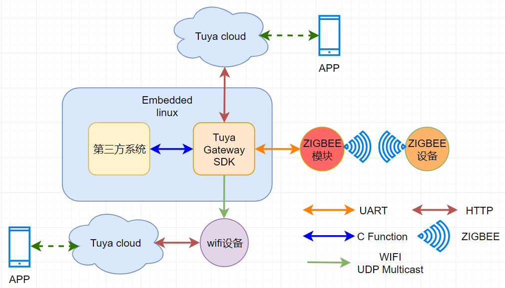

# TUYA_ROUTER_GW_SDK 接入指南

## 功能概述
涂鸦zigbee网关SDK提供涂鸦公版网关TYGWZ-01全部功能的封装，可实现快速将功能迁移到原有网关产品上，加快产品功能升级，加速开发过程；

[TYGWZ-01网关功能介绍](https://mp.weixin.qq.com/s/A5PGLD0AV5W4Ww6nLdsV7A)

TYGWZ-01 是一款 Zigbee 网关，可连接多种 Zigbee 智能产品，是智能家居的桥接和控制中心。

通过连接路由器，TYGWZ-01 实现了与云端和手机 App 的通信，用户可在 App 上轻松查看和控制家中采用 Zigbee 协议的各类智能设备。

sdk仓库地址：https://github.com/TuyaInc/TUYA_ROUTER_GW_SDK

## 总体结构
SDK对底层zigbee通信，网关和云通信，wifi设备和网关通信进行了封装。第三方系统可以调用SDK暴露出来的函数接口，赋予第三方系统通过涂鸦云控制zigbee设备的能力和wifi入网的能力。使第三方系统开发人员可以完全专注于本系统的业务功能实现，从而大大降低系统的开发门坎与难度。SDK 与所涉及到周边系统的总体结构如图1所示：

根据总体结构，用户只要完成第三方系统和SDK之间的函数调用，第三方系统就会具备通过手机APP连接涂鸦云去控制zigbee设备和wifi设备的能力。其中涂鸦的SDK是以C静态连接库（.a文件） 的形式提供给第三方系统，第三方系统作为宿主程序，负责SDK的初始化及结束处理。所以要得到SDK，需要用户提供相应的编译工具链才能生成，并且生成的宿主程序需要运行在linux环境，SDK和第三方系统的通信通过函数的调用实现。