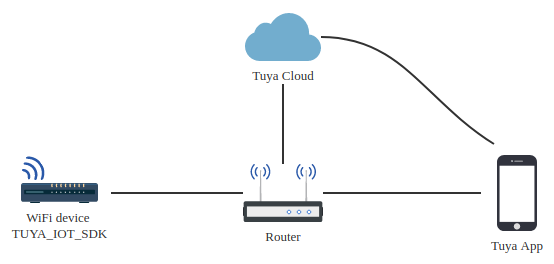

# TUYA_IOT_SDK 接入指南

## 功能概述

TUYA_IOT_SDK提供了基于linux系统的wifi硬件设备、涂鸦APP、涂鸦云通信的接口封装，加速开发过程，主要包括了以下功能：

- 提供符合涂鸦标准数据规范的上下行通道：控制指令下发、状态上报、扫地机地图数据上报等
- 提供数据过滤服务：数据校验、规则上报、上报频率控制等
- 提供涂鸦标准化服务，例如设备配网、固件升级、本地定时、局域网控制等功能
- 通信传输过程中的数据安全服务
- github仓库地址：https://github.com/TuyaInc/TUYA_IOT_SDK.git

## 文档使用者

如果你的wifi设备要接入涂鸦云，请参考本文档说明；

