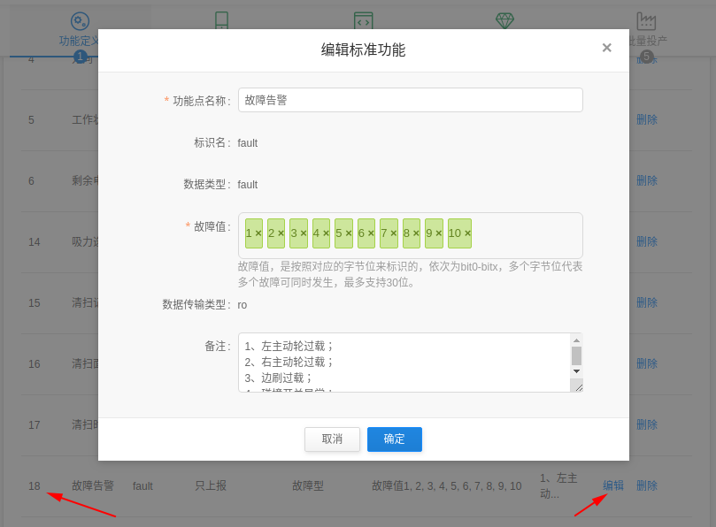
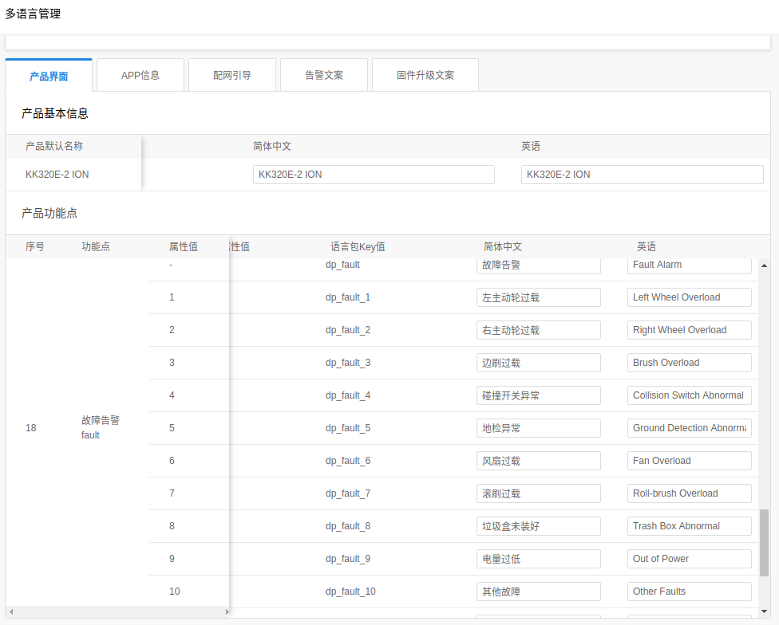
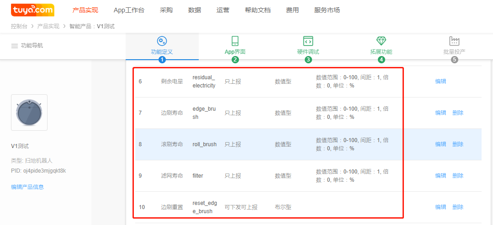

## 数据上报接口说明


### 设备状态上报链路图
```uml
@startuml
title device status report
participant TuyaApp
participant Device
participant tuya_sdk
participant TuyaCloud

Note over tuya_sdk:255.255.255.255:6667
Note over TuyaApp:用户已打开
TuyaApp->tuya_sdk:局域网内搜索到设备，建立tcp连接
tuya_sdk-->TuyaApp:ACK
Device->tuya_sdk:dev_report_dp_xxx_sync
tuya_sdk-->tuya_sdk:Store(Msg)
tuya_sdk->TuyaApp:先走局域网发送
tuya_sdk->TuyaCloud:PUBLISH(Qos1,Msg)
TuyaCloud-->TuyaCloud:Store(Msg)
TuyaCloud->TuyaApp:PUBLISH(Qos1,Msg)
TuyaCloud-->tuya_sdk:PUBACK
tuya_sdk-->tuya_sdk:Delete(Msg)
tuya_sdk->Device:return OPRT_OK
TuyaApp-->TuyaCloud:PUBACK
TuyaCloud-->TuyaCloud:Delete(Msg)
Note over TuyaApp:用户已关闭
Device->tuya_sdk:dev_report_dp_xxx_sync
tuya_sdk-->tuya_sdk:Store(Msg)
tuya_sdk->TuyaCloud:PUBLISH(Qos1,Msg)
TuyaCloud-->TuyaCloud:Store(Msg)
TuyaCloud-->tuya_sdk:PUBACK
tuya_sdk-->tuya_sdk:Delete(Msg)
tuya_sdk->Device:return OPRT_OK
@enduml
```

**说明：**
1. 对于同步上报接口，如果在接口超时时间到时，tuya_sdk还未收到服务器的PUBACK，接口返回失败；根据enable_auto_retrans参数不同，tuya_sdk动作如下：
    - enable_auto_retrans = TRUE, tuya_sdk保留未发送成功的消息(和服务器保持连接的情况下)，并自动尝试重新发送；
    - enable_auto_retrans = FALSE,tuya_sdk直接Delete(Msg)


### 接口说明

#### dev_report_dp_json_async

1. 为异步上报接口， PUBLISH(Qos1,Msg);
2. tuya_sdk不会等待服务器的PUBACK，立即返回给设备

```c
/***********************************************************
*  Function: dev_report_dp_json_async
*  Desc:     report dp info a-synced.
*  Input:    devid: if sub-device, then devid = sub-device_id
*                   if gateway/soc/mcu, then devid = NULL
*  Input:    dp_data: dp array header
*  Input:    cnt    : dp array count
*  Return:   OPRT_OK: success  Other: fail
***********************************************************/
OPERATE_RET dev_report_dp_json_async(IN CONST CHAR_T *dev_id,IN CONST TY_OBJ_DP_S *dp_data,IN CONST UINT_T cnt);
```

#### dev_report_dp_stat_sync

1. 同步上报接口，PUBLISH(Qos1,Msg);

```c
/***********************************************************
*  Function: dev_report_dp_stat_sync
*  Desc:     report dp status info synced.
*            if time_stamp==0, time_stamp = time of msg arrival of the server
*  Input:    devid: if sub-device, then devid = sub-device_id
*                   if gateway/soc/mcu, then devid = NULL
*  Input:    dp_data: dp status array header
*  Input:    cnt    : dp status array count
*  Input:    timeout: function blocks until timeout seconds
*  Return:   OPRT_OK: success  Other: fail
***********************************************************/
#define dev_report_dp_stat_sync(dev_id, dp_data, cnt, timeout) \
    dev_report_dp_stat_sync_extend(dev_id, dp_data, cnt, timeout, TRUE)
OPERATE_RET dev_report_dp_stat_sync_extend(IN CONST CHAR_T *dev_id,IN CONST TY_OBJ_DP_S *dp_data,\
                                    IN CONST UINT_T cnt,IN CONST UINT_T timeout, IN CONST BOOL_T enable_auto_retrans);
```

#### dev_report_dp_raw_sync

1. 为同步上报接口， PUBLISH(Qos1,Msg);

```c
/***********************************************************
*  Function: dev_report_dp_raw_sync
*  Desc:     report dp raw info synced.
*  Input:    devid: if sub-device, then devid = sub-device_id
*                   if gateway/soc/mcu, then devid = NULL
*  Input:    dpid: raw dp id
*  Input:    data: raw data
*  Input:    len : len of raw data
*  Input:    timeout: function blocks until timeout seconds
*  Return:   OPRT_OK: success  Other: fail
***********************************************************/
#define dev_report_dp_raw_sync(dev_id, dpid, data, len, timeout) \
    dev_report_dp_raw_sync_extend(dev_id, dpid, data, len, timeout, TRUE)
OPERATE_RET dev_report_dp_raw_sync_extend(IN CONST CHAR_T *dev_id,IN CONST BYTE_T dpid,\
                                                      IN CONST BYTE_T *data,IN CONST UINT_T len,\
                                                      IN CONST UINT_T timeout, IN CONST BOOL_T enable_auto_retrans);
```

## 实例代码

### RAW型数据上报

```c
/*****************************************************************
 * @Function: tuya_iot_sdk_upload_raw
 * @Description: 上报RAW型数据示例说明
 * @Param: Do not edit
 * @Return: void
 *****************************************************************/
OPERATE_RET tuya_iot_sdk_upload_raw(void)
{
    OPERATE_RET op_ret;

    unsigned char dpid = 19;
    unsigned char data[] = {"iot.tuya.com"};
    op_ret = dev_report_dp_raw_sync(NULL,dpid,data,sizeof(data),5);
    if (op_ret != OPRT_OK){
        PR_ERR("dev_report_dp_raw_sync op_ret:%d",op_ret);
    }
    else{
        PR_NOTICE("dev_report_dp_raw_sync success");
    }
    return op_ret;
}
```


### 数值型value数据上报

如下图所示，我们以扫地机产品为例来说明DP_ID = 16的清扫面积功能点上报方法


1. 数值范围 1 ～ 9999，最大可定义范围(-2147483648～2147483647)
2. 间距 1， 即上报合法的数据为 1 2 3 …… 9999
3. 倍数 1， 也可以理解为数值精度，APP界面显示数值 = 设备上报数值 * 10^(-1)
    
    如设备上报 121，手机界面显示12.1

**代码参考**

```c
/*****************************************************************
 * @Function: tuya_iot_sdk_upload_value
 * @Description: 上报数值型数据示例说明
 * @Param: signed int value
 * @Return: OPERATE_RET
 *****************************************************************/
OPERATE_RET tuya_iot_sdk_upload_value(signed int value)
{
    OPERATE_RET op_ret;
    TY_OBJ_DP_S value_dp;

    value_dp.dpid = 16;
    value_dp.time_stamp = 0; // dp happen time. if 0, mean now
    value_dp.type = PROP_VALUE;
    value_dp.value.dp_value = value;

    op_ret = dev_report_dp_json_async(NULL,&value_dp,sizeof(value_dp)/sizeof(TY_OBJ_DP_S));
    if (op_ret != OPRT_OK){
        PR_ERR("dev_report_dp_json_async op_ret:%d",op_ret);
    }
    else{
        PR_NOTICE("dev_report_dp_json_async success");
    }

    return op_ret;
}
```

### 故障型bitmap数据上报

如下图所示，我们以扫地机产品为例来说明DP_ID = 18的故障告警功能点上报方法：



**代码参考**

```c
#define     Clean_Fault                 (0x00)      // 清除故障显示
#define     Left_Wheel_Overload         (0x01)      // 左主动轮过载  
#define     Right_Wheel_Overload        (0x02)      // 右主动轮过载  
#define     Brush_Overload              (0x04)      // 边刷过载  
#define     Collision_Switch_Abnormal   (0x08)      // 碰撞开关异常  
#define     Ground_Detection_Abnormal   (0x10)      // 地检异常  
#define     Fan_Overload                (0x20)      // 风扇过载  
#define     Roll_brush_Overload         (0x40)      // 滚刷过载  
#define     Trash_Box_Abnormal          (0x80)      // 垃圾盒未装好
#define     Out_of_Power                (0x0100)    // 电量过低
#define     Other_Faults                (0x0200)    // 其他故障
/*****************************************************************
 * @Function: tuya_iot_sdk_upload_bitmap
 * @Description: 上报故障型数据示例说明
 * @Param: Do not edit
 * @Return: void
 *****************************************************************/
OPERATE_RET tuya_iot_sdk_upload_bitmap(void)
{
    OPERATE_RET op_ret;
    TY_OBJ_DP_S bitmap_dp;

    bitmap_dp.dpid = 18;
    bitmap_dp.time_stamp = 0;  // dp happen time. if 0, mean now
    bitmap_dp.type = PROP_BITMAP;
    bitmap_dp.value.dp_bitmap = (Out_of_Power | Ground_Detection_Abnormal); // 上报电量过低 & 地检异常

    op_ret = dev_report_dp_json_async(NULL,&bitmap_dp,sizeof(bitmap_dp)/sizeof(TY_OBJ_DP_S));
    if (op_ret != OPRT_OK){
        PR_ERR("dev_report_dp_json_async op_ret:%d",op_ret);
    }
    else{
        PR_NOTICE("dev_report_dp_json_async success");
    }
}

```

**故障显示语言配置**

具体操作请参考产品多语言管理：https://docs.tuya.com/cn/product/product-language.html



### 字符串型string数据上报

这里以上报一个json格式的数据为例

**代码参考**

```c
/*****************************************************************
 * @Function: tuya_iot_sdk_upload_str
 * @Description: 上报字符串型数据示例说明，以上报一个cjson字符串为例
 * @Param: Do not edit
 * @Return: OPERATE_RET
 *****************************************************************/
OPERATE_RET tuya_iot_sdk_upload_str(void)
{
    cJSON * pJsonRoot = NULL;
    pJsonRoot = cJSON_CreateObject();
    if(NULL == pJsonRoot){
        return OPRT_MALLOC_FAILED;
    }
    cJSON_AddStringToObject(pJsonRoot, "obj1", "Hello TuyaInc");
    cJSON_AddNumberToObject(pJsonRoot, "number", 10010);
    cJSON_AddBoolToObject(pJsonRoot, "bool", 1);

    char * pJsonStr = cJSON_PrintUnformatted(pJsonRoot);
    printf("pJsonRoot:%s\n",pJsonStr);
    cJSON_Delete(pJsonRoot);

    // 增加转义字符
    char *pConJsonStr = NULL;
    pConJsonStr = str_replace(pJsonStr,"\"","\\\"");
    if(NULL == pConJsonStr){
        return OPRT_MALLOC_FAILED;
    }
    printf("pConJsonStr:%s\n",pConJsonStr);

    OPERATE_RET op_ret;
    TY_OBJ_DP_S str_dp;

    str_dp.dpid = 15;
    str_dp.time_stamp = 0; // dp happen time. if 0, mean now
    str_dp.type = PROP_STR;
    str_dp.value.dp_str = pConJsonStr;
    op_ret = dev_report_dp_json_async(NULL,&str_dp,sizeof(str_dp)/sizeof(TY_OBJ_DP_S));
    if (op_ret != OPRT_OK){
        PR_ERR("dev_report_dp_json_async op_ret:%d",op_ret);
    }
    else{
        PR_NOTICE("dev_report_dp_json_async success");
    }
    free(pConJsonStr);
    free(pJsonStr);

    return op_ret;
}

/*****************************************************************
 * @Function: str_replace
 * @Description: Do not edit
 * @Param: Do not edit
 * @Return: value, 要记得free(value)
 *****************************************************************/
char *str_replace(const char *src, const char *from, const char *to)
{
   size_t size    = strlen(src) + 1;
   size_t fromlen = strlen(from);
   size_t tolen   = strlen(to);
   char *value = malloc(size);
   char *dst = value;
   if ( value != NULL )
   {
      for ( ;; )
      {
         const char *match = strstr(src, from);
         if ( match != NULL ){
            size_t count = match - src;
            char *temp;
            size += tolen - fromlen;
            temp = realloc(value, size);
            if ( temp == NULL ){
               free(value);
               return NULL;
            }
            dst = temp + (dst - value);
            value = temp;
            memmove(dst, src, count);
            src += count;
            dst += count;
            memmove(dst, to, tolen);
            src += fromlen;
            dst += tolen;
         }
         else /* No match found. */
         {
            strcpy(dst, src);
            break;
         }
      }
   }
   return value;
}
```

### 数据组合上报

如下以组合上报扫地机器人设备的剩余电量、边刷寿命、滚刷寿命、滤网寿命数据；



**代码参考**
```c
    TY_OBJ_DP_S dp_msg[4];
    // 剩余电量
    dp_msg[0].dpid = 6;
    dp_msg[0].type = PROP_VALUE;
    dp_msg[0].value.dp_value = 100; 
    dp_msg[0].time_stamp = 0;
    // 边刷寿命
    dp_msg[1].dpid = 7;
    dp_msg[1].type = PROP_VALUE;
    dp_msg[1].value.dp_value = 99; 
    dp_msg[1].time_stamp = 0;
    // 滚刷寿命
    dp_msg[2].dpid = 8;
    dp_msg[2].type = PROP_VALUE;
    dp_msg[2].value.dp_value = 90;
    dp_msg[2].time_stamp = 0;
    // 滤网寿命
    dp_msg[3].dpid = 9;
    dp_msg[3].type = PROP_VALUE;
    dp_msg[3].value.dp_value = 0;
    dp_msg[3].time_stamp = 0;
    op_ret =  dev_report_dp_json_async(NULL,dp_msg,sizeof(dp_msg)/sizeof(TY_OBJ_DP_S));
    if (op_ret != OPRT_OK){
        PR_ERR("dev_report_dp_json_async op_ret:%d\n", op_ret);
        return op_ret;
    }
    PR_NOTICE("dev_report_dp_json_async success");
```