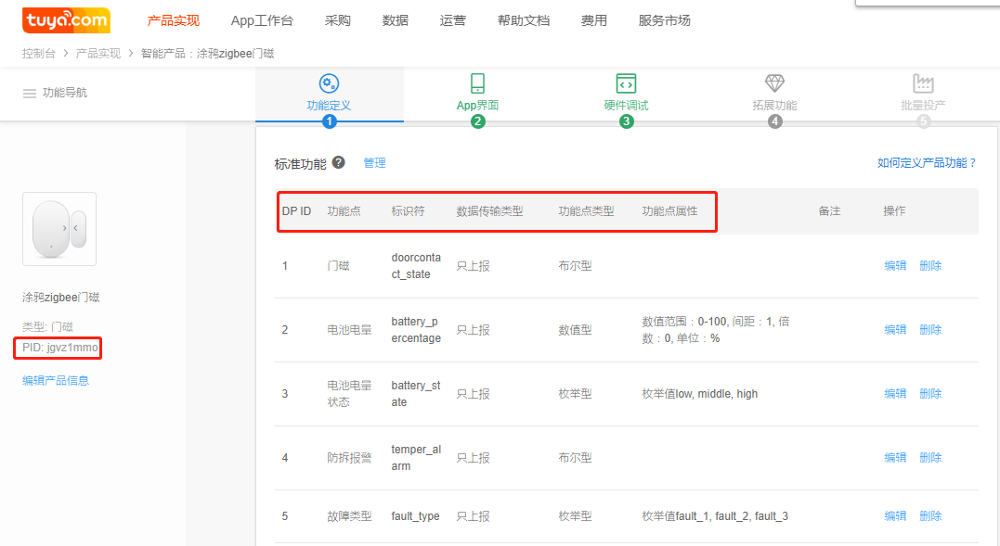

## 设备控制

- 涂鸦提供基于mqtt网络应用协议，实现设备控制和状态上报，MQTT是一个轻量的发布订阅模式消息传输协议，专门针对低带宽和不稳定网络环境的物联网应用设计。
- tuya_sdk封装了mqtt协议层实现，以功能点(以下称为dp点)的形式呈现，支持数值型、布尔型、枚举型、字符串型、故障型，RAW型数据，像定义C变量一样简单。
- 开发者需要根据设备功能在涂鸦开发者平台创建对应的功能点，新建dp点说明:https://docs.tuya.com/cn/product/function.html

- dp值数据结构

```c
/* tuya sdk obj dp manage info */
typedef struct {
    BYTE_T dpid;                // dp id
    DP_PROP_TP_E type;          // dp type
    TY_OBJ_DP_VALUE_U value;    // dp value
    UINT_T time_stamp;          // dp happen time. if 0, mean now
}TY_OBJ_DP_S;

// dp schema type
typedef BYTE_T DP_PROP_TP_E;
#define PROP_BOOL 0
#define PROP_VALUE 1
#define PROP_STR 2
#define PROP_ENUM 3
#define PROP_BITMAP 4

/* tuya sdk dp value union */
typedef union {
    INT_T dp_value;             // valid when dp type is value
    UINT_T dp_enum;             // valid when dp type is enum
    CHAR_T *dp_str;             // valid when dp type is str
    BOOL_T dp_bool;             // valid when dp type is bool
    UINT_T dp_bitmap;           // valid when dp type is bitmap
}TY_OBJ_DP_VALUE_U;
```

- 功能点示例

如下，在涂鸦开发平台创建一个zigbee门磁设备



