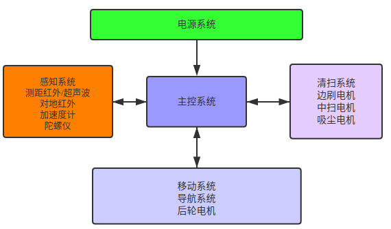

# 陀螺仪扫地机demo
- 这里说明在树莓派上模拟运行一个陀螺仪扫地机的设备并连接涂鸦云。

## 陀螺仪扫地机原理简述


## 涂鸦陀螺仪扫地机传输协议
```c
// 涂鸦陀螺仪地图传输协议
typedef struct
{
    uint8_t   x;
    uint8_t   y;
    uint8_t   type;
} ST_POT;
/* 坐标点类型 */
enum enum_point_type
{
    point_type_current              = 0x00, // 当前点
    point_type_barrier,                     // 障碍点
    point_type_cleaned,                     // 已清扫点
    point_type_charge,                      // 充电桩
};
```
- [地图上报参考](20-media.md#流服务)
## 涂鸦陀螺仪扫地机公版面板
- 如下，从左到右边依次是 1号面板 2号面板 3号面板

    
    
    

- 2号 3号面板没有用到电源开关power功能点，创建产品时请删除

## 开发准备
### 产品创建
- [注册涂鸦开发者账号，并完成认证](https://iot.tuya.com)
- [创建扫地机产品](https://docs.tuya.com/docDetail?code=K8uhkt9au8b3o),如下箭头所指为PID，为代码中的PRODUCT_KEY宏
    
- [ubuntu虚拟机开发环境搭建](https://www.baidu.com/)

### 硬件准备
- 树莓派采用 Raspberry Pi 3 Model B

 

- 硬件配置
    - Quad Core 1.2GHz Broadcom BCM2837 64bit CPU
    - 1GB RAM
    - BCM43438 wireless LAN，开发配网，连接到涂鸦云
    - Bluetooth Low Energy (BLE) on board
    - 100 Base Ethernet，用于ssh登陆开发板调试用
    - [其他资源](https://www.raspberrypi.org/products/raspberry-pi-3-model-b/)
- 调试方法
    - 为方便，直接在ubuntu虚拟机的Terminal通过ssh登录到树莓派开发板上调试。
    - 操作方法：树莓派网口和路由器的lan口相连，登陆路由器获取树莓派ip地址，我这里为192.168.56.107；ubuntu虚拟机网络设置为桥接模式，PC主机和树莓派连接到同一路由器下
    ```
    tuya@E480:～$ ssh root@192.168.56.107
    root@192.168.56.107's password: 
    Last login: Thu Oct 24 18:47:17 2019 from 192.168.56.100
    root@RasPi:~# 
    ```
- 确认无线网卡支持的配网模式
    - 小贴士：无线网
    - iw list命令可以查看linux系统设备下无线网卡详细信息
    ```
    root@RasPi:~# iw list 
    Wiphy phy0
        Supported interface modes:  无线网卡支持的工作模式
            * IBSS
            * managed       station客户端模式
            * AP            无线接入点模式，这里可用于开发tuyasdk的ap配网
            * P2P-client
            * P2P-GO
            * P2P-device
        ......省略其他信息
    ```
    - 如上配置，这个网卡不支持sniffer模式，无法开发SmartConfig配网模式

## 基本实现思路
- 这里不是一个真实的扫地机，从涂鸦云导出真实扫地机设备行走产生的地图坐标数据保存到磁盘文件
- 代码里新增一个线程负责从文件定时读取数据上报涂鸦云，以在APP上展现机器行走的效果,如下
 

## 软件开发说明
- 陀螺仪扫地机为wifi单品开发，[参考TUYA_IOT_SDK说明](01-Scope.md#TUYAIOTSDK接入指南)
- [工具链获取](https://github.com/LinusZhao/toolchain),这里推荐一个第三方资源，涂鸦不提供芯片工具链。
- [demo源码获取](https://github.com/LinusZhao/tuya_gyro_robot_demo)
- demo功能说明
    - 支持AP配网模式
    - 支持涂鸦陀螺仪三种陀螺仪面板
    - 支持设备OTA
    - 编译时可选是运行在ubuntu设备上还是树莓派

## 关键代码说明
- 代码位置：src/gyro_wifi_dev/tuya_iot_wifi_net.c
### 设置网卡工作模式
```c
// 设置当前WIFI工作模式
OPERATE_RET hwl_wf_wk_mode_set(IN CONST WF_WK_MD_E mode)
{
#if defined(USE_RASPI)
   switch (mode){
       case WWM_STATION:{
           sys_shell("ifconfig %s down", WLAN_DEV);
           sys_shell("iwconfig %s mode Managed", WLAN_DEV);
           sys_shell("ifconfig %s up", WLAN_DEV);
       }break;
       case WWM_SOFTAP:{
           // handle in hwl_wf_ap_start()
           break;
       }
       case WWM_STATIONAP:break;
       default:break;
   }
#endif
    return OPRT_OK;
}
```
### 开启无线网卡热点
```c
// AP配网模式下开启热点
OPERATE_RET hwl_wf_ap_start(IN CONST WF_AP_CFG_IF_S *cfg)
{
    PR_DEBUG("Start AP SSID:%s", cfg->ssid);
#if defined(USE_RASPI)
    sys_shell("ifconfig "WLAN_DEV" "DEFAULT_IP_ADDR);
    sys_shell("iwconfig %s mode Managed", WLAN_DEV);
    
    kill_process("hostapd");
    kill_process("udhcpd");
    kill_process("wpa_supplicant");
    sys_shell("hostapd -B " HOSTAPD_CONF);
    sys_shell("udhcpd -f " UDHCPD_CONF " &");
#endif
    return OPRT_OK;
}
```
### 关闭无线网卡热点
```c
// AP配网模式下停止热点
OPERATE_RET hwl_wf_ap_stop(VOID)
{
    PR_DEBUG("Stop Ap Mode");
#if defined(USE_RASPI)
    kill_process("hostapd");
    kill_process("udhcpd");
#endif
    return OPRT_OK;
}
```
### 连接路由器
```c
// 使用指定SSID和PASSWD连接WIFI
OPERATE_RET hwl_wf_station_connect(IN CONST CHAR_T *ssid,IN CONST CHAR_T *passwd)
{
    PR_DEBUG("STA Con AP ssid:%s passwd:%s", ssid, passwd);
#if defined(USE_RASPI)
    // UserTODO
    sys_shell("sed -i '/ssid/c\\    ssid=\"%s\"' " WPA_SUPPLICANT_CONF,ssid);
    sys_shell("sed -i '/psk/c\\    psk=\"%s\"' " WPA_SUPPLICANT_CONF,passwd);
    // sys_shell("wpa_supplicant -Dnone -B -i" WLAN_DEV " -c" WPA_SUPPLICANT_CONF); // 加Dnone 不可行
    sys_shell("wpa_supplicant -B -i" WLAN_DEV " -c" WPA_SUPPLICANT_CONF);
    sys_shell("udhcpc -i" WLAN_DEV);
    // sys_shell("dhclient"" "WLAN_DEV);
#endif
    return OPRT_OK;
}
```
### 获取当前WIFI联网状态
```c
OPERATE_RET hwl_wf_station_stat_get(OUT WF_STATION_STAT_E *stat)
{
#if defined(USE_RASPI)
    // UserTODO
    NW_IP_S current_ip; // 上一次获取的ip
    memset(&current_ip,0,sizeof(current_ip));
    hwl_wf_get_ip(WF_STATION,&current_ip);

    if(strcmp(current_ip.ip, DEFAULT_IP_ADDR)){
        *stat = WSS_GOT_IP;
    }else{
        *stat = WSS_CONN_FAIL;
    }
#else
    *stat = WSS_GOT_IP;
#endif
    return OPRT_OK;
}
```

