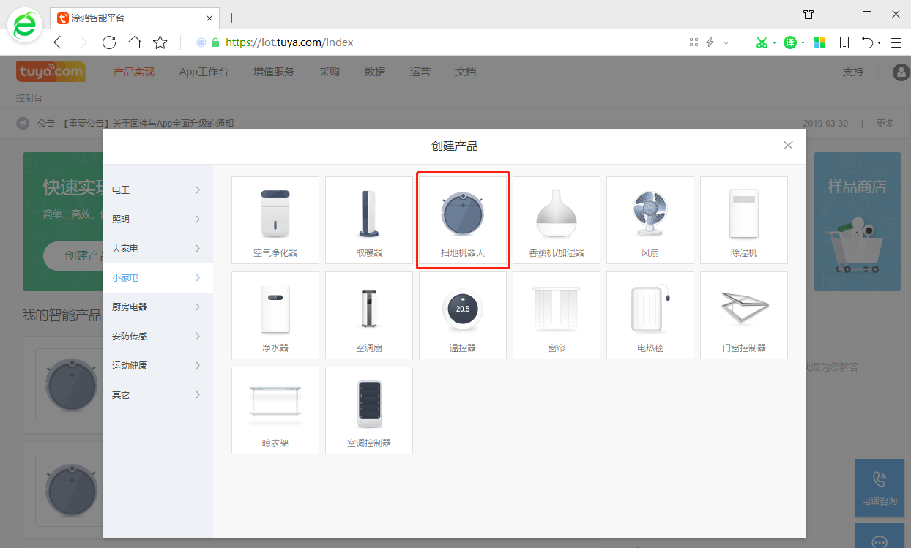
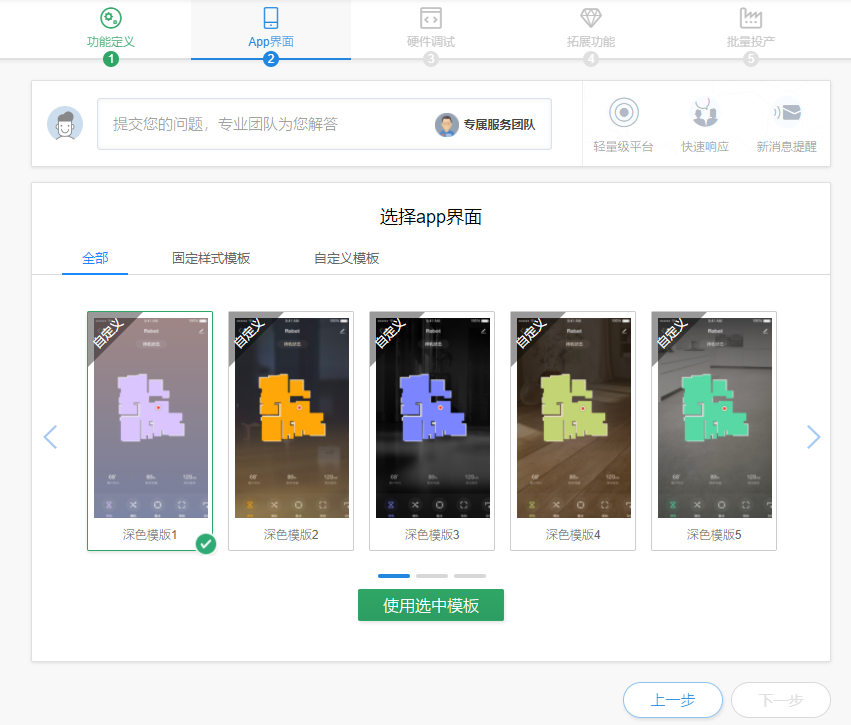
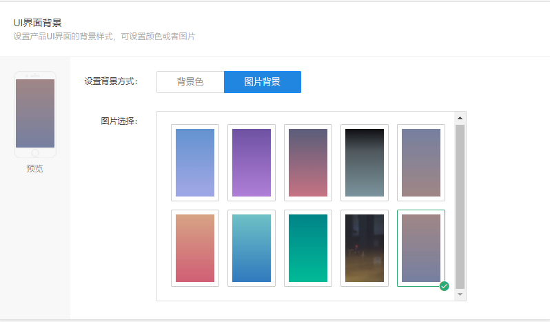
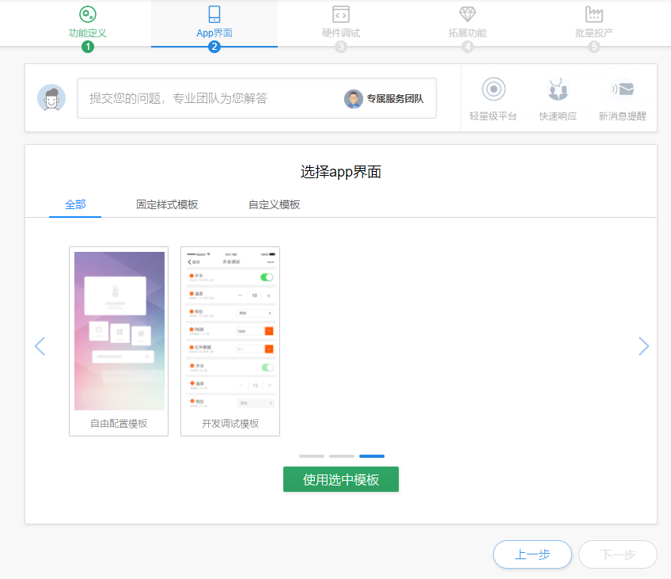
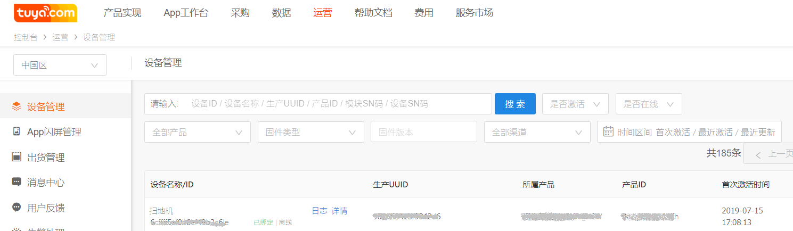
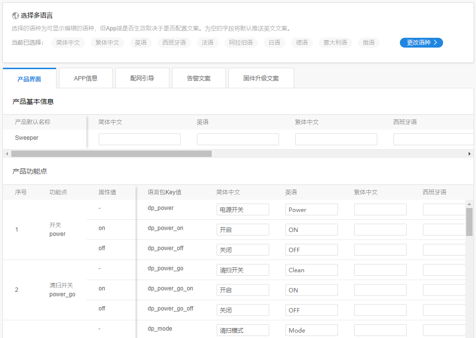
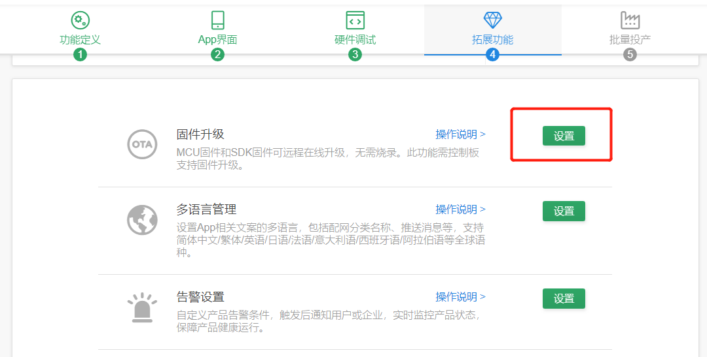

### 惯导型扫地机器人对接流程

#### 1、准备工作

   在涂鸦IOT平台，注册开发者账号，开启产品智能化工作，为了使用运营相关功能，请开通企业版权限。
   IOT平台链接：https://iot.tuya.com。

#### 2、产品定义

##### 2.1 新建产品

   在涂鸦IOT平台创建产品，选择【小家电】-【扫地机器人】，点击“创建产品”即可开始创建产品。 

     
    

##### 2.2 产品功能定义

 ###### 1）标准化功能
   创建产品后，对扫地机产品功能进行定义。可以选择模板中的全部功能，也可以选择部分，同时支持自定义功能的编辑。
   标准功能与IOT平台提供的APP面板相对应，用于快速开发。若标准功能不能满足使用需要，可以进行定义新功能，并进行定制APP的开发。
   标准功能中部分枚举型功能允许用户新增类型，如清扫模式，工作状态，错误码等。

     

###### 2）自定义功能
   对于标准功能外的产品需求，允许用户自定义产品功能。在“自定义功能”中进行新增，新增后，在APP的功能页面中会生产控制项。
   IOT平台提供布尔、数值、枚举、字符、故障、raw等数据类型，支持上下行，详细介绍参考：https://docs.tuya.com/cn/product/function.html。

     
    

#### 3、APP界面配置

产品定义后，APP端可以选择不同风格的面板，作为扫地机的控制页面。在IOT平台，提供公版面板、自定义面板、自由配置面板，以及开发调试面板，供用户选择。
公版面板：样式与交互固定，可设置背景、颜色等内容，用于产品量产。
自由配置面板：支持自由设置页面控件及样式，用于自定义产品；
调试面板：以开关选项方式显示机器端数据，用于开发阶段调试；

     
    

#### 4、产品硬件开发

##### 4.1 硬件开发
扫地机主板通过云模组，与涂鸦云和APP进行通讯连接。在产品新建后，选择适用的云模组，并根据主板、云模组的接口电路及产品要求，完成硬件电路的开发。

     

目前，扫地机产品可供选用的是WR3 WIFI模组，模组详细说明，请参考：https://docs.tuya.com/cn/hardware/WiFi-module/wifi-wr3-module.html。

##### 4.2 MCU程序开发
云模组通过串口通讯方式与MCU对接，MCU端开发过程主要涉及协议的解析和调试，有两种方式可选择：
###### 1）串口协议方式
MCU根据串口协议，自行组包和解包，实现指令的上报和执行；

###### 2）接口函数方式
移植IOT平台封装好的接口文件，MCU直接调用相关函数，以加速开发过程。
开发详情请参考：https://docs.tuya.com/cn/product/mcu-dev.html。

##### 4.3 机器功能调试
在产品开发的验证和调试阶段，可采用IOT平台提供的调试助手及调试面板，对技术方案进行验证，辅助开发过程的开发调试。
###### 1）仿真助手
涂鸦云仿真助手，通过PC端和MCU进行连接，模拟产品DP点数据的收发，用于验证MCU数据发送是否满足涂鸦的通信协议和云模组工作流程。

     

仿真助手使用详情，请参考：https://docs.tuya.com/cn/mcu/cloud_debug_assistant.html。

###### 2） 面板调试

在产品配网功能调试通过后，通过APP对扫地机进行配网，在APP上对扫地机进行相关操作，验证指令收发，APP显示、机器执行等是否正确。

同时，在模块化开发时，可以借助调试面板功能，单独调试某个DP的逻辑是否正确。

     

 ###### 3）日志查询

IOT平台提供日志查询功能，可以查看扫地机MCU与APP间的数据通讯情况，适用于异常情况下，排查各端的操作情况。

     

#### 5、APP构建

在IOT页面的【APP工作台】，配置APP名称、LOG、配网文案、产品图标等信息，生成厂商标识信息的OEM APP。
APP构建，请参考：https://docs.tuya.com/zh/iot/app-development/oem-app/app-autobuilding/appautobuilding

     

#### 6、相关配置

##### 6.1 多语言配置
多语言是指APP设备控制页的文字显示，在“拓展功能”的“多语言配置”，可对设置功能点进行多语言管理，当产品功能创建完成后，针对产品销售区域，设置不同语言内容，便于App显示的文案。

     
    

##### 6.2 OTA升级

   对于支持MCU固件升级的厂家，可以在此上传MCU固件，进行远程固件升级。上传固件后，先进行固件的测试验证，通过后，才可对外发布固件，确保不影响用户使用。

     
    

