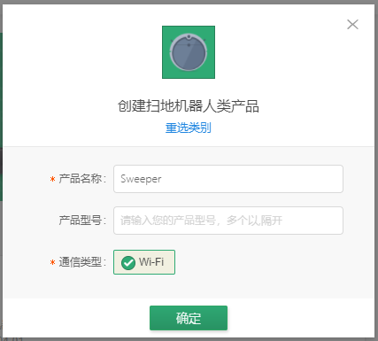
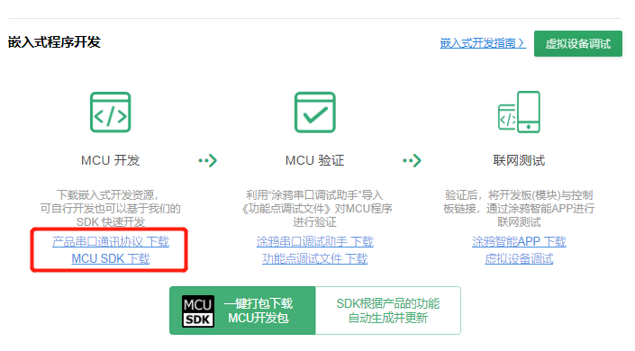
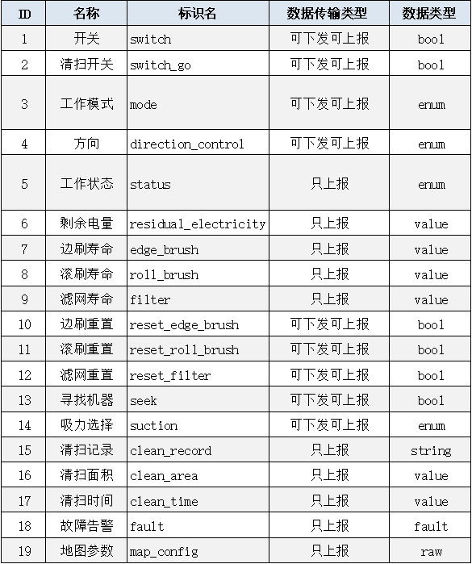

# 惯导型扫地机MCU开发说明


# 1 前期准备

## 1.1 注册账号

   在涂鸦IOT平台，注册开发者账号，开启产品智能化工作，为了使用运营相关功能，请开通企业版权限。
   IOT平台链接：https://iot.tuya.com。


## 1.2 产品定义

1、在涂鸦IOT平台创建产品，选择【小家电】-【扫地机器人】，点击“创建产品”即可开始创建产品。 

<center class="half">
     
    
</center>

2、可根据产品功能，基于公版定义的DP库，自由选择DP或编辑DP内容。

<center class="half">
     
    
</center>

3、产品定义后，选择适配的云模组，并在IOT平台采购样片。

<center class="half">
     
</center>

4、完成相关定义后，IOT平台会根据产品定义和云模组型号，生成相应的数据协议，请下载并保存。

<center class="half">
     
</center>

详细操作请参考：


# 2 硬件对接

在硬件开发时，结合MCU主控电路情况，将云模组接入主控电路，实现模组与主控的物理连接，具体过程由开发者自行完成。


**【相关说明请参考】** https://docs.tuya.com/zh/iot/device-development/module/wifi-module/mcu-typical-reference-of-wifi-module/wifie3smodulemcu


# 3 通讯协议

惯导型扫地机设备端与云端及APP的数据交互分为两部分协议，一是产品功能协议（DP协议），二是地图数据协议。

产品功能协议，在产品定义时生成，涵盖各产品功能点的上报和下发方式。（见1.2节）

数据传输协议，用于定义清扫地图的显示方式、地图数据点格式。

## 3.1 功能DP

以惯导型扫地机通用版产品DP定义为例，其产品DP定义如下:

<center class="half">
     
</center>


根据功能DP的特点，可以将其分为控制类、状态类、传输类三种类型：

控制类DP：主要实现APP和机器间的控制交互，数据类型通常布尔型、枚举型，如清扫开关、清扫模式；

状态类DP：主要实现机器端状态型数据上报，数据类型通常是数值型、字符型，如清扫时间、剩余电量；

传输类DP：主要实现APP和机器间的通讯交互，数据类型通常是字符型、RAW型，如清扫记录、地图参数；


## 3.3 地图传输

地图数据协议主要包括地图参数配置、地图数据包的格式，具体格式如下：

**1、地图参数配置**

机器初始化时，机器向云端上报地图配置参数，用于告知APP，当前地图的长宽、以及坐标原点的位置。

地图参数格式：

```c
  // 地图配置参数定义
  typedef struct
  {
      uint8_t   origin; // 地图原点位置，0-左上角  1-左下角
      uint8_t   width;  // 地图宽度，最大255
      uint8_t   hight;  // 地图高度，最大255      
  }ST_CONFIG; 
```


**2、地图数据包格式**

机器启动清扫时，机器向云端上报地图数据包，APP在收到地图数据后，更新当前地图，呈现完整的清扫地图画面。

地图数据格式：

```c
// 地图坐标点定义
typedef struct
{
    uint8_t   x;
    uint8_t   y;
    uint8_t   type;
} ST_POT;

// 坐标点类型定义
enum enum_point_type
{
    point_type_current   = 0x00,  // 当前点
    point_type_barrier   = 0x01,  // 障碍点
    point_type_cleaned   = 0x02,  // 已清扫点
    point_type_charge    = 0x03， // 充电桩
};
```


## 3.4 相关附件

1、[公版产品标准DP定义及交互参考](https://github.com/LinusZhao/tuya_gyro_robot_demo/blob/master/mcu_sdk/doc/03-DP%E5%AE%9A%E4%B9%89%E5%8F%8A%E4%BA%A4%E4%BA%92_2019_12_2.xlsx)

2、参考[公版产品标准通讯协议](https://docs.tuya.com/zh/iot/device-development/access-mode/mcu-solution-wifi/wifi-general-solution/tuya-cloud-universal-serial-port-access-protocol)的**3.23扫地机地图数据服务(可选)** 章节


## 4  MCU开发

### 4.1 开发方式

机器主控与云模组通过串口通信方式进行通讯，MCU端交互部分的开发有两种方式：

串口指令：MCU与模组通过指令码方式进行交互。优点：代码量少，不占用MCU资源。

接口移植：MCU调用模组的接口函数进行交互。优点：接口丰富，开发方便。

详细说明请参考：

【串口协议】https://docs.tuya.com/zh/iot/device-development/access-mode/mcu-solution-wifi/wifi-general-solution/tuya-cloud-universal-serial-port-access-protocol

【接口移植】：https://docs.tuya.com/zh/iot/device-development/access-mode/mcu-solution-wifi/wifi-general-solution/sdk-transplant


### 4.2 通用功能

**1、配网**

【配网功能及指示灯函数完善】 https://docs.tuya.com/zh/iot/device-development/access-mode/mcu-solution-wifi/wifi-general-solution/sdk-transplant 

**2、OTA**

【确认 MCU 是否需要支固件升级】 https://docs.tuya.com/zh/iot/device-development/access-mode/mcu-solution-wifi/wifi-general-solution/sdk-transplant 


### 4.3 关键交互

**1、DP数据交互**

1）机器启动时，上报初始值到云端；

2）手动启动机器时，上报相应的控制开关、状态数值到云端；

3）清扫开关、清扫模式等控制类DP，机器在接收到APP的指令并成功执行后，上报原始值到云端；

**2、地图配置上报**

```c
/*****************************************************************
 * @Function: app_panel_init
 * @Description: 配置涂鸦智能APP面板显示的地图尺寸和原点位置            
 * @Param: origin, 地图原点位置，0-左上角  1-左下角
 * @Param: map_size, 目前最大支持显示255*255个坐标点
 * @Return: void
 *****************************************************************/
void app_panel_init(unsigned char origin,unsigned short map_size)
{
    unsigned char buffer[3] = {0};
    buffer[0] = origin;
    buffer[1] = map_size >> 8;
    buffer[2] = map_size & 0xFF;
    mcu_dp_raw_update(DPID_MAP_CONFIG,buffer,sizeof(buffer)); //RAW型数据上报;
}
```

**3、地图数据上报**

```c
/*****************************************************************
 * @Function: mcu_map_data_report
 * @Description: 地图数据上报            
 * @Param: id, 地图id号，用于标识一次完整的清扫过程
 * @Param: buffer, 地图坐标点数组
 * @Param: point_num, 坐标点数量
 * @Return: void
 *****************************************************************/
unsigned char  mcu_map_data_report(MAP_ID_S id, ST_POT *buffer, unsigned short point_num)
{
    static unsigned int map_offset = 0;
    static MAP_ID_S last_id = 0;
    unsigned short this_len = 0;

    if(stop_update_flag == ENABLE)
        return SUCCESS;

    if(last_id != id){ // 开始新的清扫，map_id更新
        map_offset = 0;
    }

    this_len = sizeof(GYRO_MAP_S) * point_num;
    stream_trans(id, map_offset, (unsigned char *)buffer, this_len);
    map_offset += this_len;

    last_id = id;

    return SUCCESS;
}
```

### 4.4 参考源码

【GitHub】 https://github.com/LinusZhao/tuya_gyro_robot_demo/tree/master/mcu_sdk 


# 5 工程调试

**1、功能调试**

机器MCU程序开发完成后，用APP对机器进行配网，在APP上对扫地机进行相关操作，验证指令收发，APP显示、机器执行等是否正确。
<center class="half">
     
</center>

**2、单点调试**

当MCU采用在模块化并行开发时，可以借助调试面板功能，单独调试某个DP的逻辑是否正确。（对于定制型项目，在APP定制完成前，也可以采用调试面板进行辅助开发）

<center class="half">
     
</center>

**3、日志查询**
IOT平台提供日志查询功能，可以查看扫地机MCU与APP间的数据通讯情况，适用于异常情况下，排查各端的操作情况。

<center class="half">
     
</center>


# 6 其他

**1、OTA后台配置**
对于支持MCU固件升级的厂家，可以在此上传MCU固件，进行远程固件升级。上传固件后，先进行固件的测试验证，通过后，才可对外发布固件，确保不影响用户使用。

<center class="half">
     
    
</center>


**2、三方语音开通**
扫地机可以接收Alexa等三方语音的指令，音箱下发的指令码，与DP定义的指令一致，常用的控制功能有开启清扫、结束清扫、回充、寻找机器等。不同音箱支持的指令稍有差异。

三方语音开通请参考：https://tuyainc.github.io/TUYA_IOT_SDK_doc/zh-hans/resource/gyro_voice_open.html