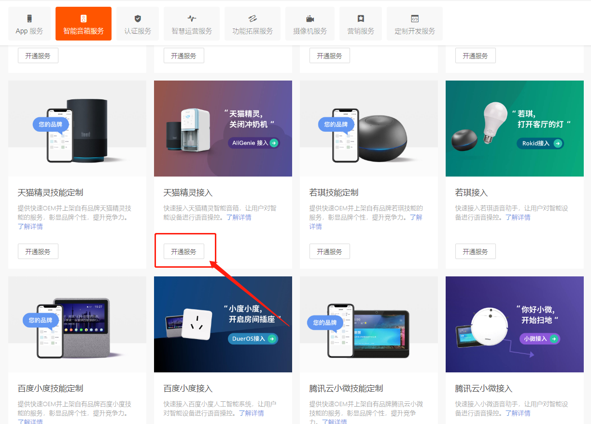
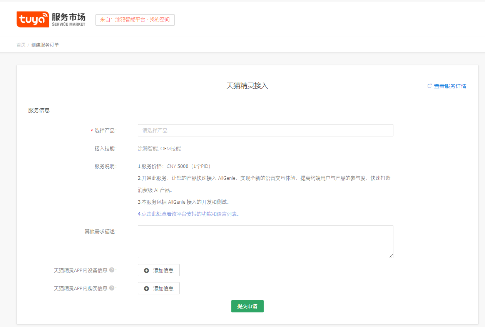

# 扫地机产品三方语音开通流程

# 1 前置条件

扫地机产品已在涂鸦IOT平台定义，并且主体功能开发完成，已实现APP对机器的远程控制。

同时，在产品的功能定义中，相关DP需满足以下要求：

| DP名称   | DP Code   | DP内容                                                 | 说明                         |
| -------- | --------- | ------------------------------------------------------ | ---------------------------- |
| 开关     | switch    | {"type":"bool"}                                        | 可选项                       |
| 清扫开关 | switch_go | {"type":"bool"}                                        | 必选项                       |
| 工作模式 | mode      | {"range":["standby","smart","chargego"],"type":"enum"} | 必选项，枚举值可根据需要新增 |
| 寻找机器 | seek      | {"type":"bool"}                                        | 可选项                       |

# 2 语音方案

基于IOT平台公版定义的扫地机产品，默认支持4种标准语音方案：

     

**【说明】：如果标准方案不能满足需求，则请联系涂鸦相关人员。**

# 3 申请流程

1、在涂鸦IOT平台登录，同时确保所需开通的产品在当前账号下。

2、选择顶部【服务市场】。

     

3、选择【智能音箱服务】。

     

4、选择需要开通的语音平台，拿天猫精灵举例，在【天猫精灵接入】，点击【开通服务】。

     

5、选择需要开通语音的产品，填写相关信息。

     

**在“其他需求描述”，必须明确，每个功能，需要音箱下发什么指令。（第2节描述的语音方案）**  

6、点击提交，等待开通；（通常2-3个工作日）

7、收到开通完成的信息。

8、借助实物音箱，进行功能验证。

【说明】：验证时若出现异常，请在涂鸦平台，提出问题工单，描述异常现象，及预期的正确结果，平台将安排专员跟进解决。

     

# 4 相关文档

第三方接入说明：https://docs.tuya.com/zh/iot/service-market/smart-speaker/third-access/thirdaccess

第三方使用说明：https://docs.tuya.com/zh/iot/service-market/smart-speaker/third-party-tutorial/amazonechoguide